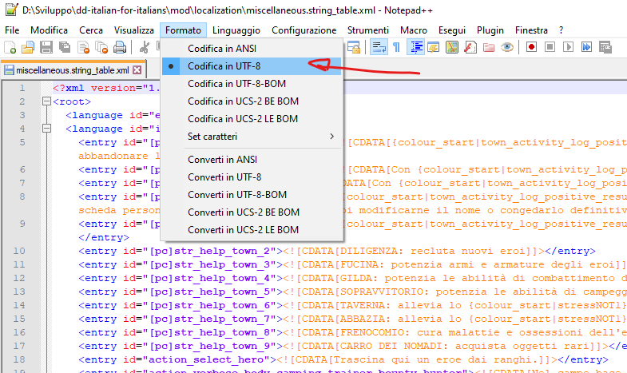
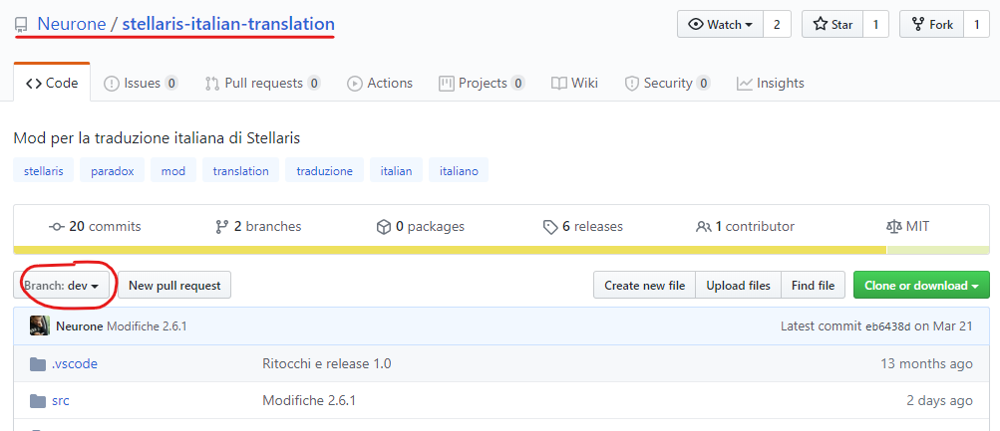
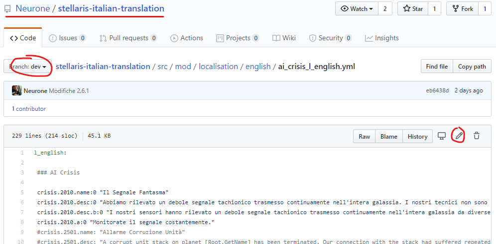
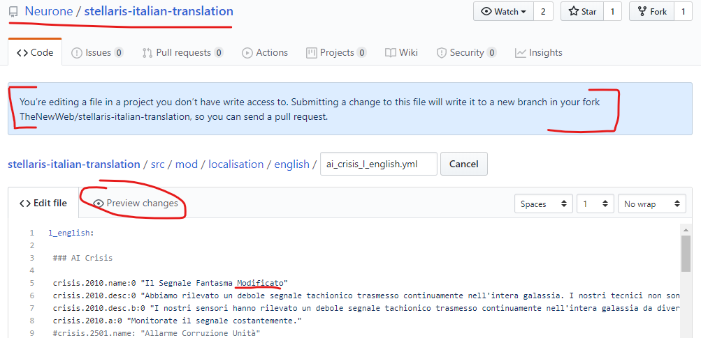
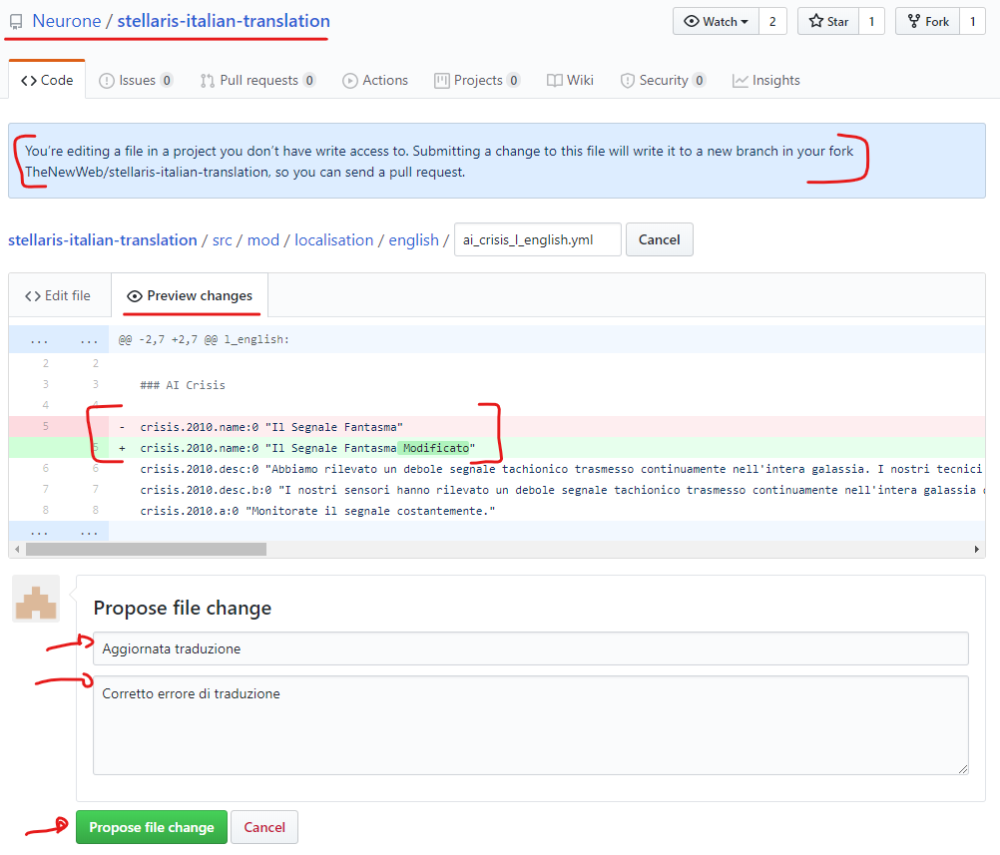
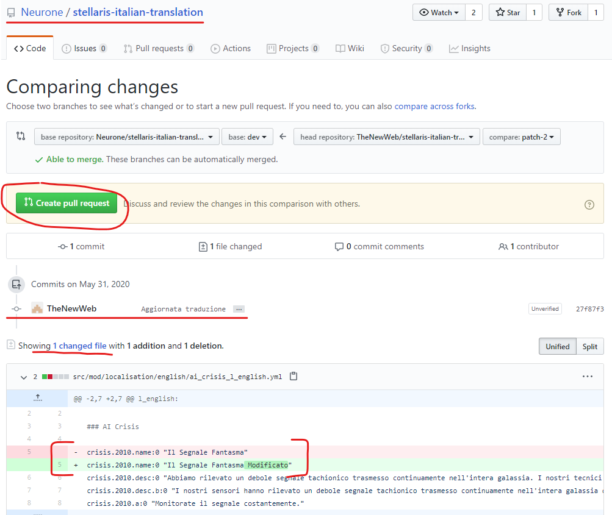
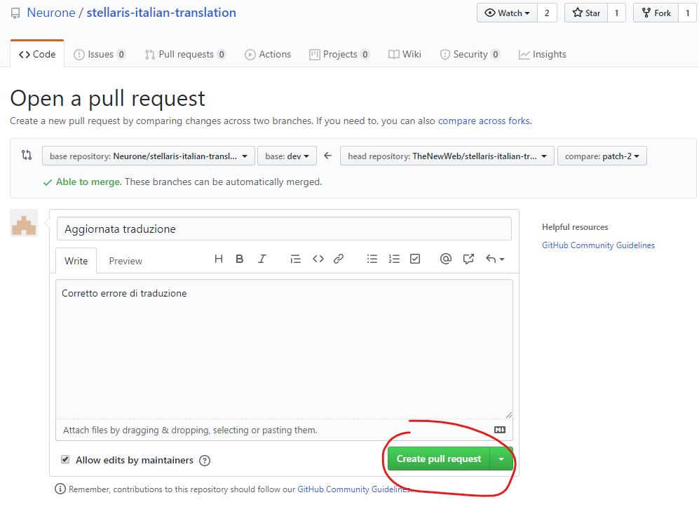
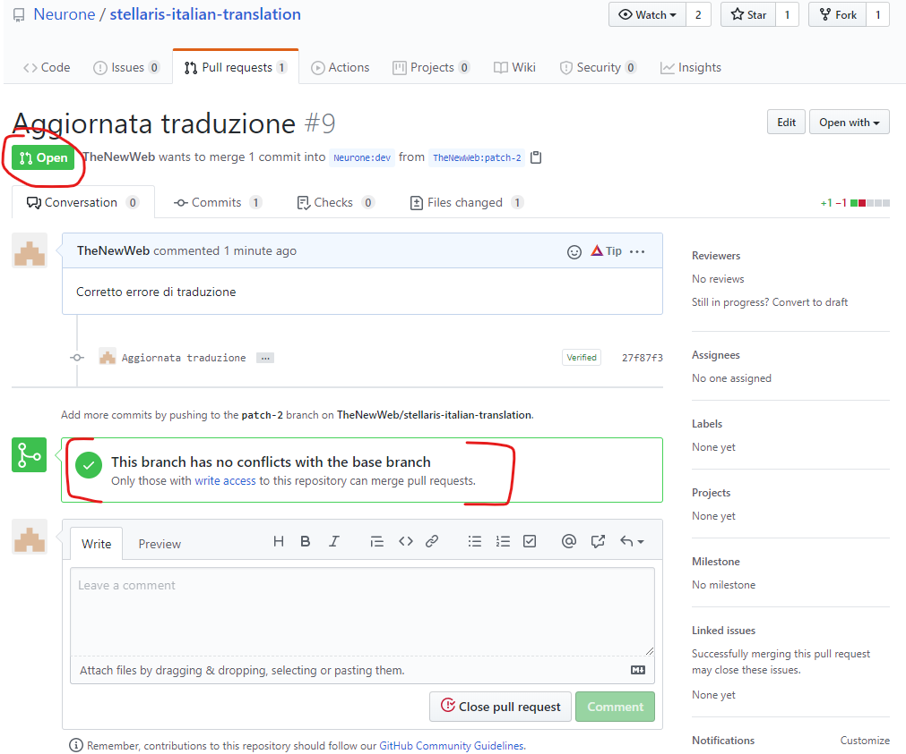
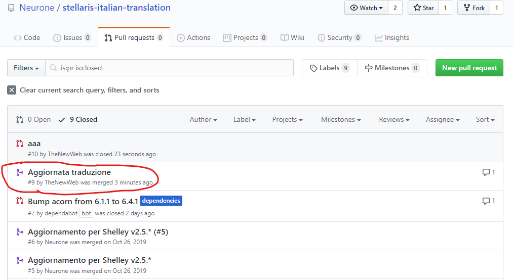
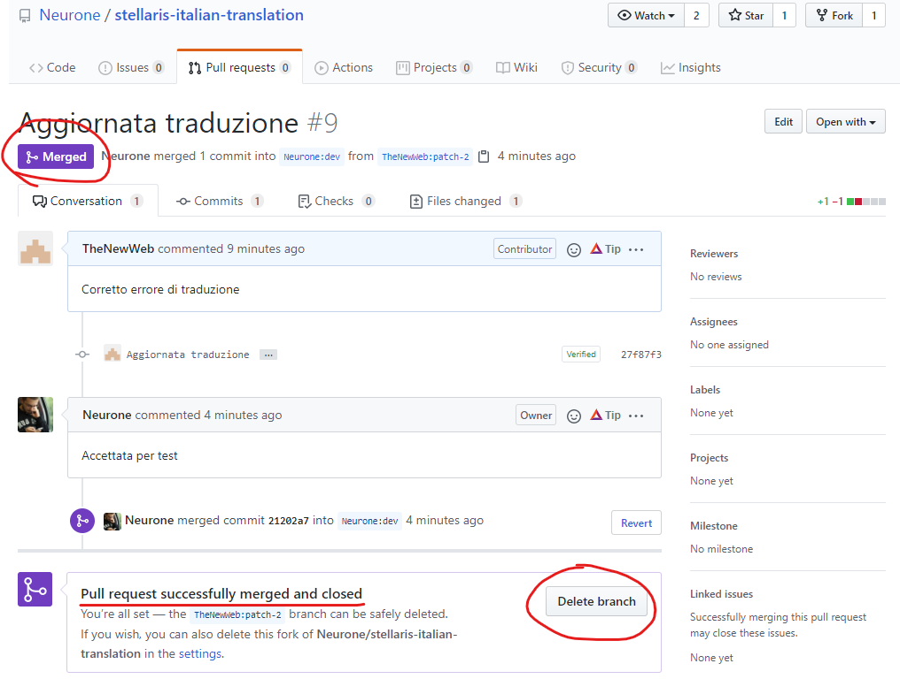

# Miglioramenti alla traduzione italiana di Darkest Dungeon

Revisioni e correzioni per la traduzione italiana di Darkest Dungeon.

Nella traduzione originale ad esempio "party" veniva tradotto con "partito", "build number" veniva tradotto con "costruiamo", ecc. :)

In aggiunta alle correzioni di traduzione, il mod contiene un elenco di poco più di 9.000 di nomi italiani che si vanno ad aggiungere ai 500 nomi standard, così che gli avventurieri abbiano dei nomi più familiari e pronunciabili per il popolo italico.

NOTA: Poiché i mod installati via Steam vengono applicati solamente dopo che si è scelta una campagna (con i relativi mod attivati) le modifiche alla traduzione per le voci del menu principale non vengono applicate (es. in alto a sinistra si vede ancora la voce "Costruzione" invece che "Versione").

## Contribuire alla traduzione

La fonte principale di frasi da tradurre di trova all'interno della cartella [mod/localisation](mod/localisation) e sono in particolare tutti i file xml che trovate.

### Codifica dei caratteri
**La codifica dei caratteri (charset) deve essere UTF-8**. Per sicurezza utilizzate direttamente un editor di testo che supporti più charset come ad esempio [Notepad++](https://notepad-plus-plus.org/downloads/) e il charset corretto verrà riconosciuto senza problemi.

### Ok, capito, ma come modifico i file?

Per contribuire alle traduzioni, potete clonare questo repository, aggiornare direttamente i file e poi procedere con una pull request per effettuare l'unione del vostro repository con quello principale.

Se non siete pratici di `git`, il mio suggerimento è di diventarlo :) E' veramente semplice da utilizzare e vi permette di lavorare in locale sul vostro PC.

Un'alternativa, è lavorare comunque sul vostro PC ma effettuare la proposta di modifica direttamente online. Di seguito una guida dettagliata: vale anche per questo repository, anche le se immagini sono per il mod di Stellaris :-)

Una volta scaricato e tradotto il file che volete aggiornare:
1. Tornate su questo repository, assicuratevi di essere sul branch **dev**

1. Navigate fino al file che volete aggiornare e premete l'icona in alto a destra per la modifica, la matita che dice "Edit this file"

1. GitHub vi avverte che non avete permessi di scrittura sul repo, che verrà creato un repository uguale a questo sulla vostra utenza e che verrà creato un nuovo ramo con le vostre modifiche. A quel punto, potrete proporre una pull request sul repository principale. Fate una modifica puntuale o, in caso di modifiche multiple, direttamente copia e incolla di tutto il contenuto del vostro file aggiornato

1. premete `Previw changes` per verificare che le modifiche siano quelle che vi aspettate. Se è tutto ok, inserite un messaggio che descrive brevemente la vostra modifica e premete **Propose file change**

1. A questo punto avete aggiornato il vostro repository, e potete procedere con la proposta di unione. Premete il pulsante **Create pull request**, modificate il testo del commit - se per qualche motivo volete cambiare il testo rispetto a quanto avete inserito precedentemente - e poi premete nuovamente **Create pull request** per confermate
 
1. La vostra pull request è stata inoltrata correttamente, risulta in stato aperto (_Open_) e non dovrebbe dare errori di unione (_This branch has no conflicts with the base branch_)

1. Attendete che la PR sia accettata e unita
1. _Opzionale_. Una volta accetta la vostra PR sarà chiusa (_Closed_) e il vostro ramo con la modifica unito (_Merged_) a quello principale. Potete quindi decidere di cancellare il ramo che è rimasto nel vostro repository, visto che ha assolto al proprio compito di proporre la modifica che è stata accettata
 

## Come creare delle modifiche

Modificare i file all'interno della cartella 'mod'

## Come effettuare l'upload del mod su Steam

Se volete creare il vostro mod, potete utilizzare la guida ufficiale [Darkest Dungeon - Modding Guide [Official]](https://steamcommunity.com/sharedfiles/filedetails/?id=819597757)

Di seguito invece i passi che effettuo come proprietario del mod per aggiornarlo.

Dalla cartella `D:\Giochi\Steam\SteamApps\common\DarkestDungeon\_windows` eseguo il comando:

`steam_workshop_upload.exe "d:\Sviluppo\dd-italian-for-italians\mod\project.xml"`

Il programma di upload creerà da solo i file .loc necessari.

### Note varie
- Inserisco dentro "mod" tutto il progetto altrimenti Steam carica anche la cartella git nel repo.
- Le modifiche alla descrizione del mod è più comodo farle da Steam direttamente, per questo il tag <ItemDescription> dentro il file project.xml è vuoto
